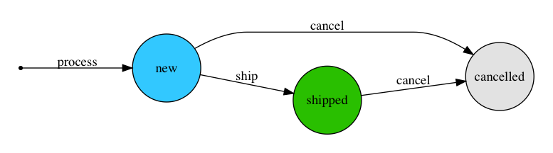

Order Management
================

Orders are created after customers complete the checkout process. The `Order` object itself contains only general information about the customer's order.

Delivery Group
--------------

The delivery group represents a group of ordered items. By default, groups are created along with an order by splitting the cart into parts, depending whether a product requires shipping or not.

Most of the order management actions are taken on the delivery groups and include changing their statuses.

There are three possible delivery group statuses:

- ``NEW``
    The default status of newly created delivery groups.

- ``SHIPPED``
    The delivery group has been marked as shipped by a shop operator. Only ``NEW`` groups can be marked as shipped.

- ``CANCELLED``
    The delivery group has been cancelled by a shop operator. Both ``NEW`` and ``SHIPPED`` groups can be marked as cancelled.

Delivery Group statuses flow
----------------------------

.. Graph is generated from transitions.dot file in graphs folder. You can edit it and convert to png (with graphviz installed) by executing: dot -Tpng docs/graphs/transitions.dot > docs/img/transitions.png

Regular flow of statuses is from ``NEW`` to ``SHIPPED``. For managing states Saleor uses `django-fsm <https://github.com/kmmbvnr/django-fsm>`_ package. Actions performed within changing status are placed in DeliveryGroup model and are as follows:

- ``process(cart_lines, discounts=None)``
    Adds specified cart lines to a group with optionally charged discounts and allocates quantity in corresponding stocks. Performed during creating order in checkout process.

- ``ship()``
    Decreases quantity in corresponding stocks. Performed just after shop operator marks group as shipped.

- ``cancel()``
    Deallocates or increases quantity in corresponding stocks, depending whether ``NEW`` or ``SHIPPED`` group is cancelled respectively. Performed just after shop operator marks group as cancelled.

Order statuses
--------------

Order status is deduced based on statuses of its delivery groups. There are two possible statuses:

- ``OPEN``
    There is at least one delivery group with the ``NEW`` status. An action by a shop operator is required to continue order processing.

- ``CLOSED``
    There are no delivery groups with the ``NEW`` status. Order doesn't require further actions by a shop operator.
