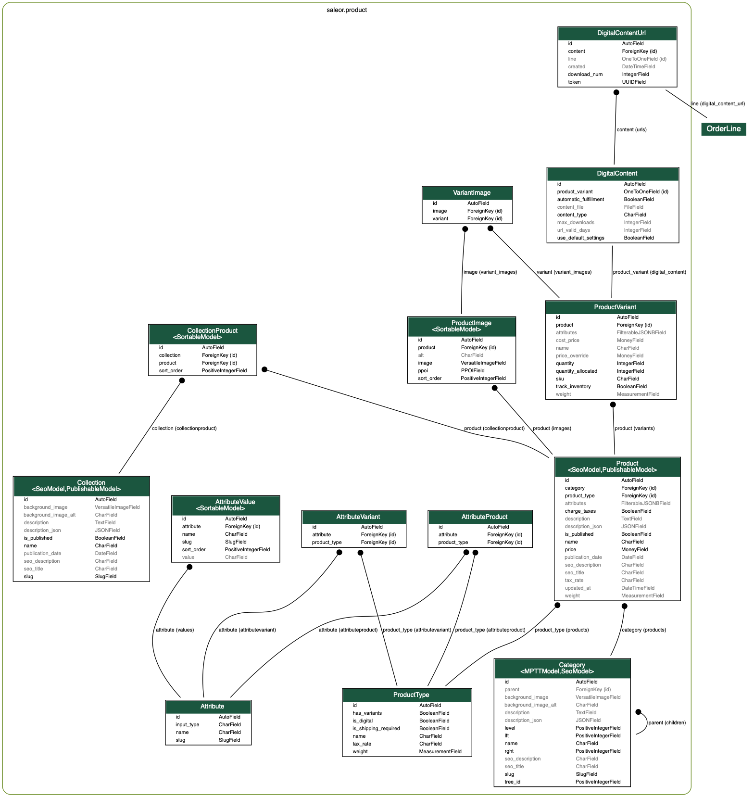

Product Structure
=================

Before filling your shop with products we need to introduce 3 product concepts - *product types*, *products*, *product variants*.

Overview
--------

Consider a book store. One of your *products* is a book titled "Introduction to Saleor".

The book is available in hard and soft cover, so there would be 2 *product variants*.

Type of cover is the only attribute which creates separate variants in our store, so we use *product type* named "Book" with variants enabled and a "Cover type" *variant attribute*.

Class Diagram
-------------

Product Variants
----------------

Variants are the most important objects in your shop. All cart and stock operations use variants. Even if a product doesn't have multiple variants, the store will create one under the hood.

Products
--------

Describes common details of a few *product variants*. When the shop displays the category view, items on the list are distinct *products*. If the variant has no overridden property (example: price), the default value is taken from the *product*.

- ``publication_date``
    Until this date the product is not listed in storefront and is unavailable for users.

Product Types
---------------

Think about types as templates for your products. Multiple *products* can use the same product type.

- ``product_attributes``
    Attributes shared among all *product variants*. Example: publisher; all book variants are published by same company.

- ``variant_attributes``
    It's what distinguishes different *variants*. Example: cover type; your book can be in hard or soft cover.

- ``is_shipping_required``
    Indicates whether purchases need to be delivered. Example: digital products or services.

- ``has_variants``
    Turn this off if your *product* does not have multiple variants or if you want to create separate *products* for every one of them.

    This option mainly simplifies product management in the dashboard. There is always at least one *variant* created under the hood.

- ``is_digital`` 
    Specify if the given product type is dedicated to digital items. ``is_shipping_required`` should be turned off along with this flag.
    Turn it on if you have digital content (ebooks, mp3s, other files) that should be send to the user after fulfillment.

.. warning:: Changing a product type affects all products of this type.

.. warning:: You can't remove a product type if there are products of that type.

Digital Products
----------------

A product can be digital. To do that you need to check two db models responsible for storing and serving digital content. 
Below you can find a description for ``DigitalContent`` and ``DigitalContentUrl``.

.. table:: DigitalContent

   =====================  ===========
   Field                  Description
   =====================  ===========
   use_default_settings   Specify if this content should be served to the customers based on default settings. By default it is True.
   automatic_fulfillment  Indicates whether digital content should be served to the customer directly after payment confirmation.
   product_variant        One to One relation to ProductVariant.
   content_file           File handler.
   max_downloads          Determines how many times a download link can be accessed by a customer.
   url_valid_days         Determines for how many days a download link is active after generation.
   =====================  ===========

.. table:: DigitalContentUrl

   =====================  ===========
   Field                  Description
   =====================  ===========
   token                  Contains a unique token needed to generate url.
   content                Foreign key to Digital Content. Specify the digital content that DigitalContentUrl belongs to.
   download_num           Number of times url was used to download content.
   line                   Foreign key to OrderLine. Fulfillment assigns a new url to line with digital product.
   =====================  ===========

``DigitalContentUrl`` contains all information about a single url that was send to a customer.

A product that will serve as digital content needs to be assigned to a product type marked as digital.
The file can be uploaded by using GraphQL api, mutation - ``digitalContentCreate`` which takes a variant_id, digital settings and file as an input. 
Each digital variant can use default or custom settings. 
To use custom settings you need to modify ``DigitalContent`` fields: ``automatic_fulfillment``, ``max_downloads``, ``url_valid_days`` and mark ``use_default_settings`` as ``false``.
You can always come back to default settings by choosing ``true`` on ``use_default_settings``.

During fulfilling a digital line, the new unique url pointing on content will be generated and assigned to the order line. 
The fulfillment email will contain information with a unique direct link to the download page.
The site settings model contains default configuration for digital products. 
You can set up default values for ``automatic_fulfillment``, ``max_downloads``, and ``url_valid_days``

Attributes
----------

*Attributes* can help you better describe your products. Also, the can be used to filter items in category views.

The attribute values display in the storefront in the order that they are listed in the list in attribute details view. You can reorder them by handling an icon on the left to the values and dragging them to another position.

There are 2 types of *attributes* - choice type and text type. If you don't provide choice values, then attribute is text type.

Examples
~~~~~~~~

* *Choice type*: Colors of a t-shirt (for example 'Red', 'Green', 'Blue')
* *Text type*: Number of pages in a book

Example: Coffee
~~~~~~~~~~~~~~~

Your shop sells Coffee from around the world. Customer can order 1kg, 500g and 250g packages. Orders are shipped by couriers.

.. table:: Attributes

   =================  ===========
   Attribute          Values
   =================  ===========
   Country of origin  * Brazil
                      * Vietnam
                      * Colombia
                      * Indonesia
   Package size       * 1kg
                      * 500g
                      * 250g
   =================  ===========

.. table:: Product type

   ======  ===================  =========  ==================  =========
   Name    Product attributes   Variants?  Variant attributes  Shipping?
   ======  ===================  =========  ==================  =========
   Coffee  * Country of origin  Yes        * Package size      Yes
   ======  ===================  =========  ==================  =========

.. table:: Product

   ============  ================  =================  =================================
   Product type  Name              Country of origin  Description
   ============  ================  =================  =================================
   Coffee        Best Java Coffee  Indonesia          Best coffee found on Java island!
   ============  ================  =================  =================================

.. table:: Variants

   ====  ============  ==============
   SKU   Package size  Price override
   ====  ============  ==============
   J001  1kg           $20
   J002  500g          $12
   J003  250g          $7
   ====  ============  ==============

Example: Online game items
~~~~~~~~~~~~~~~~~~~~~~~~~~

You have great selection of online games items. Each item is unique, important details are included in description. Bought items are shipped directly to buyer account.

.. table:: Attributes

   ==========  ================
   Attribute   Values
   ==========  ================
   Game        * Kings Online
               * War MMO
               * Target Shooter
   Max attack  ---
   ==========  ================

.. table:: Product type

   =========  ==================  =========  ==================  =========
   Name       Product attributes  Variants?  Variant attributes  Shipping?
   =========  ==================  =========  ==================  =========
   Game item  * Game              No         ---                 No
              * Max attack
   =========  ==================  =========  ==================  =========

.. table:: Products

   ============  ================  =====  ==============  ===========  =======================================================
   Product type  Name              Price  Game            Max attack   Description
   ============  ================  =====  ==============  ===========  =======================================================
   Game item     Magic Fire Sword  $199   Kings Online    8000         Unique sword for any fighter. Set your enemies on fire!
   Game item     Rapid Pistol      $2500  Target Shooter  250          Fastest pistol in the whole game.
   ============  ================  =====  ==============  ===========  =======================================================
